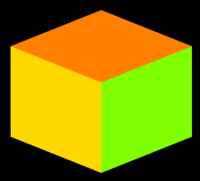

# Computer Graphics Task 3 - WebGL Tutorial

- Drawing a 2-D square with two triangles
- Drawing a 3-D cube and show the other sides

## 2-D Square from Triangles


The square was made by plotting two individual triangles to appropriate coordinates so that they merge into one an look like a single square. Here's the code snippet of the drawing and plotting process
```javascript
function draw() {
        gl.clearColor(0, 0, 0, 1);
        gl.clear(gl.COLOR_BUFFER_BIT | gl.DEPTH_BUFFER_BIT);

        let vertices = new Float32Array([
          // Define the vertices for the square
          -0.5,
          -0.5,
          0.0, // Vertex 0
          0.5,
          -0.5,
          0.0, // Vertex 1
          0.5,
          0.5,
          0.0, // Vertex 2
          -0.5,
          -0.5,
          0.0, // Vertex 3 (Shared with Vertex 0)
          0.5,
          0.5,
          0.0, // Vertex 4 (Shared with Vertex 2)
          -0.5,
          0.5,
          0.0, // Vertex 5
        ]);

        let colors = new Float32Array([
          // Define colors for the vertices (RGB)
          1,
          0,
          0, // Red
          0,
          1,
          0, // Green
          0,
          0,
          1, // Blue
          1,
          0,
          0, // Red (Shared with Vertex 0)
          0,
          0,
          1, // Blue (Shared with Vertex 2)
          0,
          1,
          0, // Green
        ]);

        gl.bindBuffer(gl.ARRAY_BUFFER, bufferCoords);
        gl.bufferData(gl.ARRAY_BUFFER, vertices, gl.STATIC_DRAW);
        gl.vertexAttribPointer(attributeCoords, 3, gl.FLOAT, false, 0, 0);
        gl.enableVertexAttribArray(attributeCoords);

        gl.bindBuffer(gl.ARRAY_BUFFER, bufferColor);
        gl.bufferData(gl.ARRAY_BUFFER, colors, gl.STATIC_DRAW);
        gl.vertexAttribPointer(attributeColor, 3, gl.FLOAT, false, 0, 0);
        gl.enableVertexAttribArray(attributeColor);

        // Triangle 1
        gl.drawArrays(gl.TRIANGLES, 0, 3);

        // Triangle 2
        gl.drawArrays(gl.TRIANGLES, 3, 3);
      }
```

## Rotating 3-D Cube
|          | Original POV | First Rotation | Second Rotation | Third Rotation |
| -------- | ------------ | -------------- | --------------- | -------------- |
| Roof On  |  |  |  |  |
| Roof Off |  |  |  |  |

The cube was made by editing the original sample code, and drawn multiple times to be able to show each angle. Here are the code snippets of the drawing and plotting process.

_Drawing and Plotting_
```javascript
function draw() {
        gl.clearColor(0, 0, 0, 1);
        gl.clear(gl.COLOR_BUFFER_BIT | gl.DEPTH_BUFFER_BIT);

        /* Draw the six faces of a cube, with different colors. */
        // drawPrimitive(gl.TRIANGLE_FAN, [1, 0.5, 0, 1], [-0.5, 0.3, -0.5, 0, 0.1, -0.5, 0.5, 0.3, -0.5, 0, 0.5, 0.4]); // front roof (orange)
        drawPrimitive(gl.TRIANGLE_FAN, [0.5, 1, 0, 1], [0, -0.4, 0, 0.5, -0.2, 0, 0.5, 0.3, 0, 0, 0.1, 0]); // front right side (lime green)
        drawPrimitive(gl.TRIANGLE_FAN, [1, 0.84, 0, 1], [-0.5, -0.2, -0.5, -0.5, 0.3, -0.5, 0, 0.1, -0.5, 0, -0.4, -0.5]); // front left side (gold)
        drawPrimitive(gl.TRIANGLE_FAN, [0, 1, 1, 1], [-0.5, 0.3, 0.5, -0.5, -0.2, 0.5, 0, 0, 0.5, 0, 0.5, 0.4]); //back left side (cyan)
        drawPrimitive(gl.TRIANGLE_FAN, [1, 0, 1, 1], [0.5, 0.3, 0.5, 0.5, -0.2, 0.5, 0, 0, 0.5, 0, 0.5, 0.4]); //back right side (magenta)
        drawPrimitive(gl.TRIANGLE_FAN, [0, 0.5, 0.5, 1], [-0.5, -0.2, 0.5, 0, -0, 0.5, 0.5, -0.2, 0.5, 0, -0.4, 0.4] ); //base (teal) 
        }
        
        // rotate 90 degrees left around Y-axis
        function draw2() {
        gl.clearColor(0, 0, 0, 1);
        gl.clear(gl.COLOR_BUFFER_BIT | gl.DEPTH_BUFFER_BIT);
    
        /* Draw the six faces of a cube, with different colors. */
        // drawPrimitive(gl.TRIANGLE_FAN, [1, 0.5, 0, 1], [-0.5, 0.3, -0.5, 0, 0.1, -0.5, 0.5, 0.3, -0.5, 0, 0.5, 0.4]); // front roof (orange)
        drawPrimitive(gl.TRIANGLE_FAN, [1, 0, 1, 1], [0, -0.4, 0, 0.5, -0.2, 0, 0.5, 0.3, 0, 0, 0.1, 0]); // front right side (magenta)
        drawPrimitive(gl.TRIANGLE_FAN, [0.5, 1, 0, 1], [-0.5, -0.2, -0.5, -0.5, 0.3, -0.5, 0, 0.1, -0.5, 0, -0.4, -0.5]); // front left side (lime green)
        drawPrimitive(gl.TRIANGLE_FAN, [1, 0.84, 0, 1], [-0.5, 0.3, 0.5, -0.5, -0.2, 0.5, 0, 0, 0.5, 0, 0.5, 0.4]); //back left side (gold)
        drawPrimitive(gl.TRIANGLE_FAN, [0, 1, 1, 1], [0.5, 0.3, 0.5, 0.5, -0.2, 0.5, 0, 0, 0.5, 0, 0.5, 0.4]); //back right side (cyan)
        drawPrimitive(gl.TRIANGLE_FAN, [0, 0.5, 0.5, 1], [-0.5, -0.2, 0.5, 0, -0, 0.5, 0.5, -0.2, 0.5, 0, -0.4, 0.4] ); //base (teal)
        }
        
        // rotate 180 degrees around Y-axis
        function draw3() {
        gl.clearColor(0, 0, 0, 1);
        gl.clear(gl.COLOR_BUFFER_BIT | gl.DEPTH_BUFFER_BIT);
    
        /* Draw the six faces of a cube, with different colors. */
        // drawPrimitive(gl.TRIANGLE_FAN, [1, 0.5, 0, 1], [-0.5, 0.3, -0.5, 0, 0.1, -0.5, 0.5, 0.3, -0.5, 0, 0.5, 0.4]); // front roof (orange)
        drawPrimitive(gl.TRIANGLE_FAN, [0, 1, 1, 1], [0, -0.4, 0, 0.5, -0.2, 0, 0.5, 0.3, 0, 0, 0.1, 0]); // front right side (cyan)
        drawPrimitive(gl.TRIANGLE_FAN, [1, 0, 1, 1], [-0.5, -0.2, -0.5, -0.5, 0.3, -0.5, 0, 0.1, -0.5, 0, -0.4, -0.5]); // front left side (magenta)
        drawPrimitive(gl.TRIANGLE_FAN, [0.5, 1, 0, 1], [-0.5, 0.3, 0.5, -0.5, -0.2, 0.5, 0, 0, 0.5, 0, 0.5, 0.4]); //back left side (lime green)
        drawPrimitive(gl.TRIANGLE_FAN, [1, 0.84, 0, 1], [0.5, 0.3, 0.5, 0.5, -0.2, 0.5, 0, 0, 0.5, 0, 0.5, 0.4]); //back right side (gold)
        drawPrimitive(gl.TRIANGLE_FAN, [0, 0.5, 0.5, 1], [-0.5, -0.2, 0.5, 0, -0, 0.5, 0.5, -0.2, 0.5, 0, -0.4, 0.4] ); //base (teal)
        }

        // rotate 270 degrees around Y-axis
        function draw4() {
        gl.clearColor(0, 0, 0, 1);
        gl.clear(gl.COLOR_BUFFER_BIT | gl.DEPTH_BUFFER_BIT);
    
        /* Draw the six faces of a cube, with different colors. */
        // drawPrimitive(gl.TRIANGLE_FAN, [1, 0.5, 0, 1], [-0.5, 0.3, -0.5, 0, 0.1, -0.5, 0.5, 0.3, -0.5, 0, 0.5, 0.4]); // front roof (orange)
        drawPrimitive(gl.TRIANGLE_FAN, [1, 0.84, 0, 1], [0, -0.4, 0, 0.5, -0.2, 0, 0.5, 0.3, 0, 0, 0.1, 0]); // front right side (gold)
        drawPrimitive(gl.TRIANGLE_FAN, [0, 1, 1, 1], [-0.5, -0.2, -0.5, -0.5, 0.3, -0.5, 0, 0.1, -0.5, 0, -0.4, -0.5]); // front left side (cyan)
        drawPrimitive(gl.TRIANGLE_FAN, [1, 0, 1, 1], [-0.5, 0.3, 0.5, -0.5, -0.2, 0.5, 0, 0, 0.5, 0, 0.5, 0.4]); //back left side (magenta)
        drawPrimitive(gl.TRIANGLE_FAN, [0.5, 1, 0, 1], [0.5, 0.3, 0.5, 0.5, -0.2, 0.5, 0, 0, 0.5, 0, 0.5, 0.4]); //back right side (lime green)
        drawPrimitive(gl.TRIANGLE_FAN, [0, 0.5, 0.5, 1], [-0.5, -0.2, 0.5, 0, -0, 0.5, 0.5, -0.2, 0.5, 0, -0.4, 0.4] ); //base (teal) 
        }
```
_Function in JavaScript to call all drawing function_
```javascript
        function drawAllViews() {
            // Define an array of drawing functions
            const drawFunctions = [draw, draw2, draw3, draw4];
            
            let currentIndex = 0;
          
            function drawNextView() {
                if (currentIndex < drawFunctions.length) {
                    drawFunctions[currentIndex]();
                    currentIndex++;
                    setTimeout(drawNextView, 1000);
                }
                }
                drawNextView();
            }
            drawAllViews();          
        } 
```
